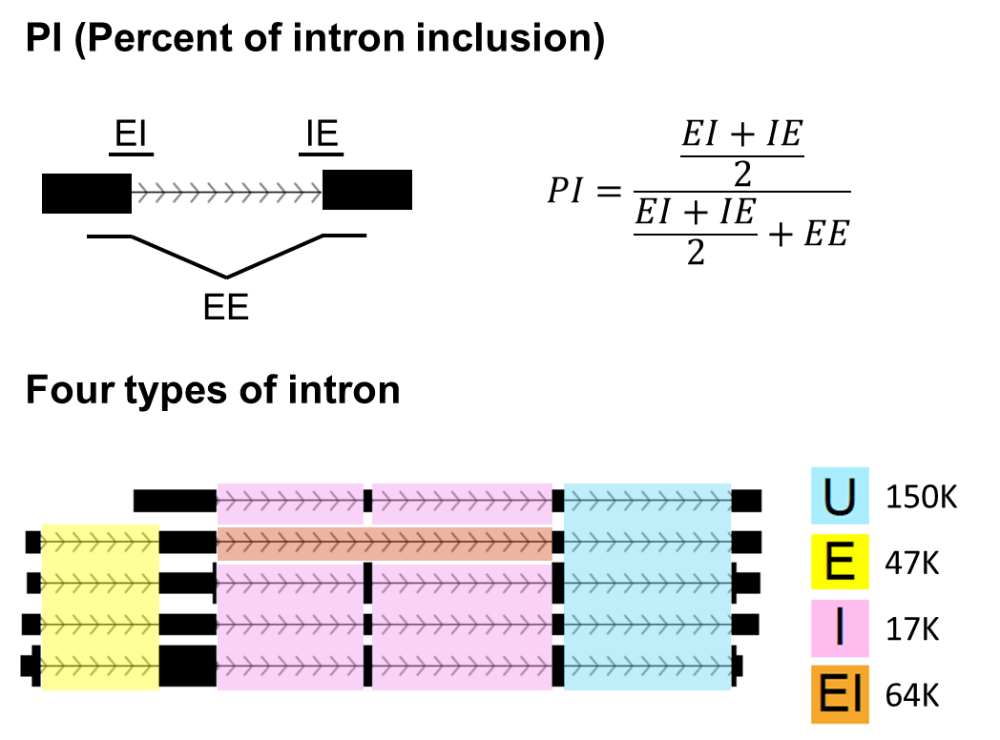

## SIRI: Systematic Investigation of Retained Introns

### Introduction
SIRI is a general tool for quantifying the percent of intron inclusions in RNA-seq data. 

  <figure class="figure1" data-title="HOMER motif">
  <figcaption>
  </figcaption>
  </figure>

#### Types of PI (Percent of Introns) calculation
#####  PI_Junction:
	Inclusion counts divided by the sum of inclusion and skipping junction counts.
##### PI_JunctionIntron:
	Inclusion counts divided by the sum of inclusion, skipping junction counts and intron body counts.
#### Types of intron retention
	U: 
    	Introns that are not partly overlapped with exons or overlapped with other introns.
    E:
    	Introns that are partly overlapped with exons but not overlapped with other introns.
    I:  
    	Introns that are overlapped with other introns but not overlapped with exons.
    EI: 
    	Introns that are both overlapped with exons and other introns.
      
### Requirements
1. Install [Python 2.7.x](https://www.python.org/downloads)
2. Install [pysam](https://pypi.python.org/pypi/pysam/0.8.4)
### Installation
The source code can be directly called from Python.
### Usage

<code>
../bin/SIRI --gtf test.gtf --bam test_R1.bam,test_R2.bam --anchor 8 --length 100 --lib first -o SIRI_Output
</code>

### Required Parameters
  	--gtf:
    	gtf files provided for PI estimation.
	--bam/bam_files:
		s1.bam/s1.sam[,s2.bam/s2.sam]. STAR mapping results for all of samples in bam/sam format. Different samples are separated by commas.
    --anchor:
    	The anchor length in nucleotide. The program will only count reads spanning junctions with at least this anchor length on each side. The default is 8.
    --length:
		The length of reads specified by user.
    --lib:
    	The library type with choices of unstrand/first/second. The details are explained in the parameter of library-type in tophat2. The default is unstrand.
    -o:
    	The output directory of results.
### Output list
#### results
The folder contains the final output of PI quantification (Intron_PI.txt).
	
    The detailed explanation of column names for Intron_PI.txt.
    
    	Intron_id:                         Intron Id representing the chromosome position, start and end
    	Gene_id:                           Gene id of intron residing genes
    	Strand:                            Strand of intron residing genes
    	Chr:                               Chromosome name of introns
    	Start:                             Start coordinate of introns
    	End:                               End coordinate of introns
    	Annotated:                         Whether this intron was annotated in the gtf file as retained intron event
    	Attributes:                        One of the four intron types, U/E/I/EI
    	Inclusion_counts:                  Inclusion junction counts separated by commas
    	Skipping_counts:                   Skipping counts separated by commas
	Inclusion_counts_with_intron_body: Inclusion junction counts plus counts from intron body.
	Inclusion_length:                  Effective inclusion junction length
    	Skipping_length:                   Effective skipping length
    	Intron_body_length:	           Effective inclusion and intron body length
    	PI_Junction:       	           PI_Junction value separated by commas
    	PI_JunctionIntron:                 PI_JunctionIntron separated by commas
      
#### gtfs
An intermediate folder contains different types of gtf files to run the program. Use test.gtf as examples.

	test.gtf:
    	the ensembl gtf files. This file should be provided by user.
    Exon_test.gtf:
    	the gtf file contains exons only
    Intron_test.gtf:
    	the gtf file contains intron only
    Intron_Annotated_test.gtf:
    	the gtf file contains the attributes whether the intron was annotated as retained introns in the original gtf files
    Intron_attri_test.gtf:
    	the gtf file contains the attributes whether the intron was overlapped with Exon and whether the intron is overlapped with other introns.
      
#### counts
An intermediate folder contains all of the count files

count_intron.txt: a file contains the counts for all of the introns   
  
    column 1:            Intron Id representing the chromosome position, start and end.
    column 2:            Gene id
    column 3:            Strand
    column 4:            Comma separated logical values to denote Whether this intron was intron (E) or intron (I) based on read info
    column 5:            Chromosome name
    column 6:            Start coordinate
    column 7:            End coordinate    
    column 8:            Inclusion counts at 5' splice sites for sample 1
    column 9:            Skipping counts at 5' splice sites for sample 1
    column 10:           Inclusion counts at 3' splice sites for sample 1
    column 11:           Skipping counts at 3' splice sites for sample 1
    column 12:           Skipping counts of the intron for sample 1
    column 13:           counts lying in the intron for sample 1
    column 14~6*(n+1)+1: more counts for samples 2~n
    
count_exon.txt: a file contains the counts for all of the exon in each gene
    
    column 1:            Gene id
    column 2~ n+1:       Gene counts in samples 2~n
    column n+2:          Gene strand
    column n+3:          The chromosome of the gene residing 
    
count_all_Density.txt: a file contains the observed counts and expected counts for all of the introns

    column 1:           Intron id representing the chromosome position, start and end.
    column 2:           The length of introns
    column 3~n+2:       The observed counts
    column n+3~2n+2:    The expected counts
    
Total.txt: a file contains total number of unique reads in each sample

    column 1~n:        Total number of unique reads in samples 1~n
### Contacts and bug reports
Yi Xing
xingyi@email.chop.edu

If you found a bug or mistake in this project, we would like to know about it.
Before you send us the bug report though, please check the following:

1. Are you using the latest version? The bug you found may already have been
   fixed.
2. Check that your input is in the correct format and you have selected the
   correct options.
3. Please reduce your input to the smallest possible size that still produces
   the bug; we will need your input data to reproduce the problem, and the
   smaller you can make it, the easier it will be.

### Copyright and License Information
Copyright (C) 2015 University of California, Los Angeles (UCLA)
Yi Xing

Authors: Zhicheng Pan, Shaofang Li, Yi Xing

This program is free software: you can redistribute it and/or modify it under
the terms of the GNU General Public License as published by the Free Software
Foundation, either version 3 of the License, or (at your option) any later
version.

This program is distributed in the hope that it will be useful, but WITHOUT
ANY WARRANTY; without even the implied warranty of MERCHANTABILITY or FITNESS
FOR A PARTICULAR PURPOSE. See the GNU General Public License for more details.

You should have received a copy of the GNU General Public License along with
this program. If not, see http://www.gnu.org/licenses/.

### Frequently Asked Questions
Q: How much RAM does SIRI require?

A: 4G is enough for the human genome. 

Q: Does the index in the comparison file 0-based or 1-based?

A: The index in the comparison file is 1-based. 
